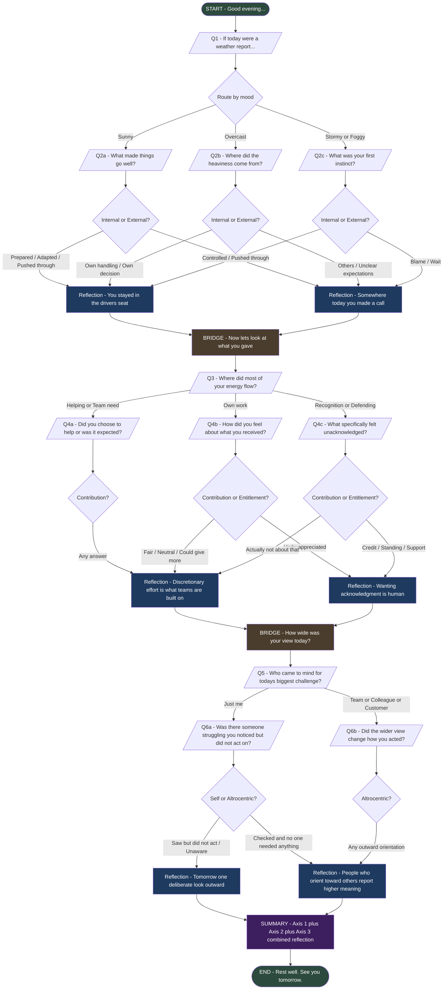

```mermaid
flowchart TD
    START([START - Good evening...]) --> A1_OPEN

    A1_OPEN[/Q1 - If today were a weather report.../]
    A1_OPEN --> A1_D1

    A1_D1{Route by mood}
    A1_D1 -->|Sunny| A1_Q_HIGH
    A1_D1 -->|Overcast| A1_Q_MID
    A1_D1 -->|Stormy or Foggy| A1_Q_LOW

    A1_Q_HIGH[/Q2a - What made things go well?/]
    A1_Q_HIGH --> A1_D2

    A1_Q_MID[/Q2b - Where did the heaviness come from?/]
    A1_Q_MID --> A1_D3

    A1_Q_LOW[/Q2c - What was your first instinct?/]
    A1_Q_LOW --> A1_D4

    A1_D2{Internal or External?}
    A1_D2 -->|Prepared / Adapted / Pushed through| A1_R_INTERNAL
    A1_D2 -->|Circumstances lined up| A1_R_EXTERNAL

    A1_D3{Internal or External?}
    A1_D3 -->|Own handling / Own decision| A1_R_INTERNAL
    A1_D3 -->|Others / Unclear expectations| A1_R_EXTERNAL

    A1_D4{Internal or External?}
    A1_D4 -->|Controlled / Pushed through| A1_R_INTERNAL
    A1_D4 -->|Blame / Wait| A1_R_EXTERNAL

    A1_R_INTERNAL[Reflection - You stayed in the drivers seat]
    A1_R_EXTERNAL[Reflection - Somewhere today you made a call]

    A1_R_INTERNAL --> BRIDGE_1_2
    A1_R_EXTERNAL --> BRIDGE_1_2

    BRIDGE_1_2[BRIDGE - Now lets look at what you gave]
    BRIDGE_1_2 --> A2_OPEN

    A2_OPEN[/Q3 - Where did most of your energy flow?/]
    A2_OPEN -->|Helping or Team need| A2_Q_CONTRIB
    A2_OPEN -->|Own work| A2_Q_SELF
    A2_OPEN -->|Recognition or Defending| A2_Q_ENTITLE

    A2_Q_CONTRIB[/Q4a - Did you choose to help or was it expected?/]
    A2_Q_SELF[/Q4b - How did you feel about what you received?/]
    A2_Q_ENTITLE[/Q4c - What specifically felt unacknowledged?/]

    A2_Q_CONTRIB --> A2_D2
    A2_Q_SELF --> A2_D3
    A2_Q_ENTITLE --> A2_D4

    A2_D2{Contribution?}
    A2_D2 -->|Any answer| A2_R_CONTRIBUTION

    A2_D3{Contribution or Entitlement?}
    A2_D3 -->|Fair / Neutral / Could give more| A2_R_CONTRIBUTION
    A2_D3 -->|Underappreciated| A2_R_ENTITLEMENT

    A2_D4{Contribution or Entitlement?}
    A2_D4 -->|Credit / Standing / Support| A2_R_ENTITLEMENT
    A2_D4 -->|Actually not about that| A2_R_CONTRIBUTION

    A2_R_CONTRIBUTION[Reflection - Discretionary effort is what teams are built on]
    A2_R_ENTITLEMENT[Reflection - Wanting acknowledgment is human]

    A2_R_CONTRIBUTION --> BRIDGE_2_3
    A2_R_ENTITLEMENT --> BRIDGE_2_3

    BRIDGE_2_3[BRIDGE - How wide was your view today?]
    BRIDGE_2_3 --> A3_OPEN

    A3_OPEN[/Q5 - Who came to mind for todays biggest challenge?/]
    A3_OPEN -->|Just me| A3_Q_SELF
    A3_OPEN -->|Team or Colleague or Customer| A3_Q_WIDE

    A3_Q_SELF[/Q6a - Was there someone struggling you noticed but did not act on?/]
    A3_Q_WIDE[/Q6b - Did the wider view change how you acted?/]

    A3_Q_SELF --> A3_D2
    A3_Q_WIDE --> A3_D3

    A3_D2{Self or Altrocentric?}
    A3_D2 -->|Saw but did not act / Unaware| A3_R_SELF
    A3_D2 -->|Checked and no one needed anything| A3_R_ALTROCENTRIC

    A3_D3{Altrocentric?}
    A3_D3 -->|Any outward orientation| A3_R_ALTROCENTRIC

    A3_R_SELF[Reflection - Tomorrow one deliberate look outward]
    A3_R_ALTROCENTRIC[Reflection - People who orient toward others report higher meaning]

    A3_R_SELF --> SUMMARY
    A3_R_ALTROCENTRIC --> SUMMARY

    SUMMARY[SUMMARY - Axis 1 plus Axis 2 plus Axis 3 combined reflection]
    SUMMARY --> END([END - Rest well. See you tomorrow.])

    style START fill:#2d4a3e,color:#fff
    style END fill:#2d4a3e,color:#fff
    style BRIDGE_1_2 fill:#4a3d2d,color:#fff
    style BRIDGE_2_3 fill:#4a3d2d,color:#fff
    style A1_R_INTERNAL fill:#1e3a5f,color:#fff
    style A1_R_EXTERNAL fill:#1e3a5f,color:#fff
    style A2_R_CONTRIBUTION fill:#1e3a5f,color:#fff
    style A2_R_ENTITLEMENT fill:#1e3a5f,color:#fff
    style A3_R_SELF fill:#1e3a5f,color:#fff
    style A3_R_ALTROCENTRIC fill:#1e3a5f,color:#fff
    style SUMMARY fill:#3d1e5f,color:#fff
```
